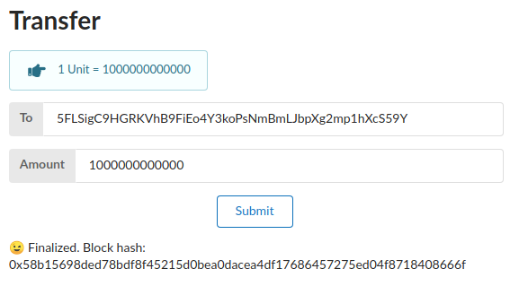

Now that your node has finished compiling, let's show you how everything works out of the box.

## Starting Your Node

Run the following commands to start your node:

```bash
# Purge chain cleans up any old data from running a `dev` node in the past
# You will be prompted to type `y`
./target/release/node-template purge-chain --dev

# Run your actual node in "development" mode
./target/release/node-template --dev
```

You should see something like this if your node is running successfully:

```
$ ./target/release/node-template --dev

2020-05-28 11:56:14 Running in --dev mode, RPC CORS has been disabled.
2020-05-28 11:56:14 Substrate Node
2020-05-28 11:56:14 ✌️  version 2.0.0-rc2-83d7157-x86_64-linux-gnu
2020-05-28 11:56:14 ❤️  by Substrate DevHub <https://github.com/substrate-developer-hub>, 2017-2020
2020-05-28 11:56:14 📋 Chain specification: Development
2020-05-28 11:56:14 🏷  Node name: marvelous-building-7886
2020-05-28 11:56:14 👤 Role: AUTHORITY
2020-05-28 11:56:14 💾 Database: RocksDb at /home/dan/.local/share/node-template/chains/dev/db
2020-05-28 11:56:14 ⛓  Native runtime: node-template-1 (node-template-1.tx1.au1)
2020-05-28 11:56:14 🔨 Initializing Genesis block/state (state: 0x3d72…572b, header-hash: 0xf1eb…57a1)
2020-05-28 11:56:14 👴 Loading GRANDPA authority set from genesis on what appears to be first startup.
2020-05-28 11:56:14 ⏱  Loaded block-time = 6000 milliseconds from genesis on first-launch
2020-05-28 11:56:14 📦 Highest known block at #0
2020-05-28 11:56:14 Using default protocol ID "sup" because none is configured in the chain specs
2020-05-28 11:56:14 🏷  Local node identity is: 12D3KooWMaPpCv7hp7wArmG6cAuyz8HXqD88zKNvVQ34CoCJsXmX (legacy representation: QmfHEbdmVZHCBwKJFvczRt5owAzEbtF7Ao7oPQLvBq645c)
2020-05-28 11:56:14 〽️ Prometheus server started at 127.0.0.1:9615
2020-05-28 11:56:18 🙌 Starting consensus session on top of parent 0xf1ebbaf6fdedadc9a657a1a7efdca8c923e0e39b16d8bee0222dfc7083fd57a1
2020-05-28 11:56:18 🎁 Prepared block for proposing at 1 [hash: 0x8197b3198b6080c7bc361b6e9a6340ad2d5908986510e3eabd66c123f001e9c3; parent_hash: 0xf1eb…57a1; extrinsics (1): [0x98e6…4426]]
2020-05-28 11:56:18 🔖 Pre-sealed block for proposal at 1. Hash now 0xa0974d53e322ca1c5712b4a80708de1091122239e90803ca4795bba6d180eea9, previously 0x8197b3198b6080c7bc361b6e9a6340ad2d5908986510e3eabd66c123f001e9c3.
2020-05-28 11:56:18 ✨ Imported #1 (0xa097…eea9)
2020-05-28 11:56:19 💤 Idle (0 peers), best: #1 (0xa097…eea9), finalized #0 (0xf1eb…57a1), ⬇ 0 ⬆ 0
2020-05-28 11:56:24 🙌 Starting consensus session on top of parent 0xa0974d53e322ca1c5712b4a80708de1091122239e90803ca4795bba6d180eea9
2020-05-28 11:56:24 🎁 Prepared block for proposing at 2 [hash: 0x56cc45eda5414ba74498997b4073a74297bc1e05481865b7b6913d56ac48e22e; parent_hash: 0xa097…eea9; extrinsics (1): [0xbacc…ce2b]]
2020-05-28 11:56:24 🔖 Pre-sealed block for proposal at 2. Hash now 0x10186a64b4875a3a48cf80d69342b882e588a3e08cc5a16755c380bdb27ed03e, previously 0x56cc45eda5414ba74498997b4073a74297bc1e05481865b7b6913d56ac48e22e.
2020-05-28 11:56:24 ✨ Imported #2 (0x1018…d03e)
2020-05-28 11:56:24 💤 Idle (0 peers), best: #2 (0x1018…d03e), finalized #0 (0xf1eb…57a1), ⬇ 0 ⬆ 0
2020-05-28 11:56:29 💤 Idle (0 peers), best: #2 (0x1018…d03e), finalized #0 (0xf1eb…57a1), ⬇ 0 ⬆ 0
2020-05-28 11:56:30 🙌 Starting consensus session on top of parent 0x10186a64b4875a3a48cf80d69342b882e588a3e08cc5a16755c380bdb27ed03e
2020-05-28 11:56:30 🎁 Prepared block for proposing at 3 [hash: 0x3427cabfd65091e81859721888ebb2221523ae6ea7b2c6ae446e91eb1306b6d3; parent_hash: 0x1018…d03e; extrinsics (1): [0x0ddb…9c1f]]
2020-05-28 11:56:30 🔖 Pre-sealed block for proposal at 3. Hash now 0x5a44bc09ad96b2b900c61e479035d58cdcc3905b8762e8efb4425deb508b3154, previously 0x3427cabfd65091e81859721888ebb2221523ae6ea7b2c6ae446e91eb1306b6d3.
2020-05-28 11:56:30 ✨ Imported #3 (0x5a44…3154)
2020-05-28 11:56:34 💤 Idle (0 peers), best: #3 (0x5a44…3154), finalized #1 (0xa097…eea9), ⬇ 0 ⬆ 0
```

If the number after `finalized:` is increasing, your blockchain is producing new blocks and reaching
consensus about the state they describe!

## Start the Front End

To interact with the local node we will use the Polkadot-js Apps user interface, often known as
"Apps" for short. Despite the name, Apps will work with any Substrate-based blockchain including
ours, not just Polkadot.

In your web browser, navigate to
[https://polkadot.js.org/apps](https://polkadot.js.org/apps/#/settings?rpc=ws://127.0.0.1:9944).

On the `Settings` tab ensure that you are connected to a `Local Node` or `ws://127.0.0.1:9944`.

> Some browsers, notably Firefox, will not connect to a local node from an https website. An easy
> work around is to try another browser, like Chromium. Another option is to
> [host this interface locally](https://github.com/polkadot-js/apps#development).

## Interact

Select the **Accounts** tab, you will see test accounts that you have access to. Some, like Alice
and Bob, already have funds!


You can try to transfer some funds from Alice to Charlie by clicking the "send" button.



If everything went successfully, you should see some popup notifications claiming "Extrinsic
Success", and of course Charlie's balance will increase.

## Create Your Own Account

You can create your own account by selecting the `+ Add Account` button. It won't have any tokens
yet, but you can send some from Alice or any other pre-funded account. Only you (and your browser)
will know the private key for your own account which means nobody can transfer those tokens except
you.

## Next Steps

This is the end of your journey to launching your first blockchain with Substrate.

You have launched a working Substrate-based blockchain, attached a user interface to that chain, and
made token transfers among users. We hope you'll continue learning about Substrate.

Your next step may be:

- Decentralize your network with more nodes in the
  [Start a Private Network](/tutorials/start-a-private-network/v2.0.0-rc2) tutorial.
- Add custom functionality in the [Build a dApp](/tutorials/build-a-dapp/v2.0.0-rc2) tutorial.

If you experienced any issues with this tutorial or want to provide feedback, feel free to
[open a GitHub issue](https://github.com/substrate-developer-hub/tutorials/issues/new) or reach out
on [Riot](https://riot.im/app/#/room/!HzySYSaIhtyWrwiwEV:matrix.org).
